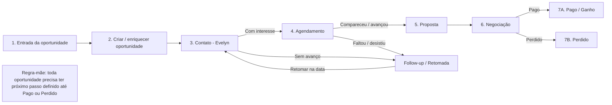

# Dermato+ — Fluxo de Prospecção e Controle Comercial

> Processo alinhado à planilha **PROSPECÇÃO - Controle de Contatos e Negociações 2025**, principalmente à aba **CONTROLE PROSPECÇÃO**.

## Regra-mãe

Toda oportunidade precisa ter **próximo passo definido** até finalizar como **PAGO** ou **PERDIDO**.

- **Fará futuramente** → data para contato futuro obrigatória.
- **Perdido** → motivo da perda obrigatório.
- **Pago** → data do pagamento, valor pago, quantidade de procedimentos e nº da conta no Feegow.
- **Agendou** → data do agendamento obrigatória.

## Responsabilidades

### Tráfego / Automação
Tipo, lista, origem, campanha e UTMs.

### Feegow
Paciente, telefone, último atendimento, proposta, pagamento, conta e procedimentos.

### Evelyn
Data do contato, canal, status do contato, próximo contato, status e data do agendamento, formulário, negociação, observações e motivo de perda.

### Planilha / Automático
Dias após primeiro contato, indicadores, conversões, ticket, taxas, comissão, valor a receber e data de comissão.

## Rotina diária

1. **Início do dia:** follow-ups, agendamentos e negociações em análise.
2. **Durante o dia:** contatos, atualização de status e próximo passo.
3. **Fim do dia:** conferir se toda oportunidade trabalhada tem status e ação seguinte.
4. **Consolidação:** exportar DigiSack, atualizar planilha e conferir Feegow.

## Indicadores-chave

Pacientes, contactados, contatos/dia, interesse, agendamentos, comparecimento, formulários, propostas, vendas, faturamento, ticket médio, procedimentos e comissão.
